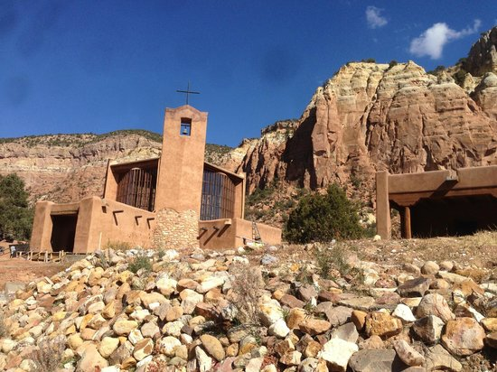

Title: The Hindus
Slug: the-hindus
Date: 2016-10-06 22:30
Category: episode
Author: the god(s) project
Summary: This is the god(s) project - where doubt isn't always the oppsite of faith.
Illustration: placeholder.jpg
Thumbnail: placeholder_icon3.jpg
Episode: 4

## Episode 1
# Heading 1
### Heading 2

The path of the righteous man is beset on all sides by the iniquities of the selfish and the tyranny of evil men. Blessed is he who, in the name of charity and good will, shepherds the weak through the valley of darkness, for he is truly his brother's keeper and the finder of lost children. And I will strike down upon thee with great vengeance and furious anger those who would attempt to poison and destroy My brothers. And you will know My name is the Lord when I lay My vengeance upon thee.



The path of the righteous man is beset on all sides by the iniquities of the selfish and the tyranny of evil men. Blessed is he who, in the name of charity and good will, shepherds the weak through the valley of darkness, for he is truly his brother's keeper and the finder of lost children. And I will strike down upon thee with great vengeance and furious anger those who would attempt to poison and destroy My brothers. And you will know My name is the Lord when I lay My vengeance upon thee.

As Kanye West said:
> We're living the future so
> the present is our past.
> stuff stuff stuff